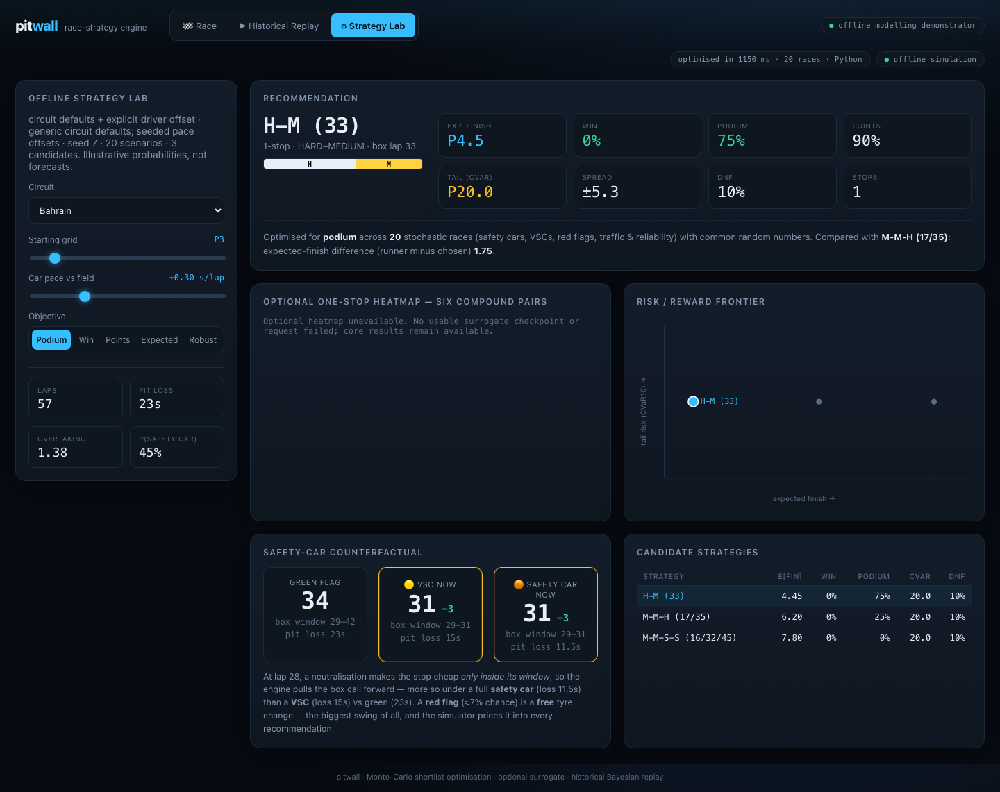

# Pitwall — race-strategy modelling prototype

Pitwall combines dynamic-programming pit scheduling, Monte Carlo shortlist ranking and Bayesian tyre estimation. It is a public-data research prototype with an offline demonstration and historical replay, not a deployed team system or current telemetry service.



[Short browser walkthrough](evidence/offline/walkthrough.webm) · [Seeded sample output](evidence/offline/transcript.txt) · [Synthetic stint plot](evidence/offline/synthetic-stint.png) · [Run manifest](evidence/offline/manifest.json) · [Limitations](docs/MODELLING_DECISIONS.md)

The screenshot and recording show actual Python simulation with circuit defaults and generic rivals. The optional heatmap is visibly unavailable. The small scenario budget demonstrates the workflow; the displayed probabilities are not reliable race forecasts.

## Run the offline demo

Clone-based use is the supported web path. Use Python **3.11 or 3.12** and Node **22 or 24**. Local validation used Python 3.11 and Node 24 on macOS arm64; Linux/Windows validation is defined in [CI](.github/workflows/offline.yml), not assumed passed. The package metadata permits Python 3.10, but the pinned demonstration environment targets 3.11–3.12.

From the repository root (POSIX shell):

```bash
python3.11 -m venv .venv
. .venv/bin/activate
python -m pip install -c requirements-offline.txt -e '.[web,dev,demo]'
npm ci --prefix web --cache .cache/npm
python scripts/offline_demo.py
bash scripts/serve.sh
```

Open **http://127.0.0.1:18743**. Strategy Lab is the default screen. Change the objective to `robust`; the recommendation, candidates and frontier update independently of the optional heatmap. Stop with Ctrl-C. If the port is occupied, set `PITWALL_PORT` to a free port before launching. Launch scripts do not install packages.

On Windows use `py -3.11 -m venv .venv`, activate `.venv\Scripts\Activate.ps1`, run the same pip/npm/demo commands, then `npm run build --prefix web` and `python -m uvicorn pitwall.server:app --host 127.0.0.1 --port 18743`.

After installation, the default Strategy Lab and fixture command need no network, checkpoint, Rust, GPU or provider account. `offline_demo.py` actively blocks socket connections. Race and Historical Replay tabs are advanced public-data paths and can need downloads; they are not the offline demo. The browser demo budget is 20 scenarios × 3 shortlisted strategies over 57 laps and 20 cars. The API caps requests at 100 scenarios.

CLI alternative (circuit defaults, no calibration download):

```bash
pitwall circuits
pitwall optimize bahrain --grid 3 --objective podium --scenarios 20 --shortlist 3 --top 3
```

## Evidence ledger

| Status | Evidence | What it establishes |
|---|---|---|
| Executed offline demonstration | [Manifest](evidence/offline/manifest.json), [JSON](evidence/offline/recommendation.json), [transcript](evidence/offline/transcript.txt) | One seeded CPU run, budget, exact source commit, environment, timing scope and metric definitions. Not an accuracy or throughput benchmark. |
| Executed browser interaction | [Screenshot](evidence/offline/strategy.png), [recording](evidence/offline/walkthrough.webm), [media notes](evidence/offline/README.md) | Recommendation survives missing weights; objective changes work. |
| Implemented and tested integration | [Regression tests](tests/test_readiness.py), [browser tests](web/tests/offline.spec.ts) | Fitted coefficients reach simulation, fixed-plan scoring changes, tiny exhaustive DP agreement, red-flag semantics, no-weights and stale/error states. |
| Synthetic estimator illustration | [Input](fixtures/synthetic-stint.json), [plot](evidence/offline/synthetic-stint.png), [updates](evidence/offline/kalman.json) | Response to a planted anomalous lap; not real telemetry or proof of baseline superiority/interval coverage. |
| Retained legacy calibration summary | [Bahrain fit](data/calibrated/bahrain.json) | In-sample residual summary only. Full command/environment/source-year provenance was not retained; not independently reproduced here. |
| Unretained experiments | [Limitations register](docs/MODELLING_DECISIONS.md) | Historical surrogate, backtest, cross-source, Kalman and native-speed results are not claimed as validated outcomes. No checkpoint is shipped. |

## How decisions are computed

| Method | Source | Scope |
|---|---|---|
| Additive lap model | [Models](src/pitwall/models/params.py) | Default tyre/fuel/pace assumptions; event fitting is explicit. |
| Pit scheduling | [Deterministic DP](src/pitwall/optimize/deterministic.py) | Optimal boundaries for each fixed compound sequence under additive free-track costs. |
| Outcome ranking | [Robust optimiser](src/pitwall/optimize/robust.py) | Stop-count-diversified shortlist, shared seeded scenarios, objective ranking and frontier. Not global adaptive optimality. |
| Model continuity | [Field construction](src/pitwall/sim/field.py) | Supplied focal model retained through scoring; explicit driver offset replaces only that offset. `build_field` rivals remain generic. |
| Calibration | [Robust fit](src/pitwall/data/calibrate.py), [opt-in priors](src/pitwall/data/priors.py) | CLI `--calibrate` passes fitted focal parameters into optimisation. Web Strategy Lab uses circuit defaults. |
| Simulation backend | [Python](src/pitwall/sim/race.py), [native boundary](src/pitwall/sim/native.py) | Response labels actual selected backend. Unsupported wet, pit-variance, dirty-air or forced-retirement settings use Python. Native RNG differs. |
| Bayesian updating | [Kalman estimator](src/pitwall/live/updater.py), [historical replay](src/pitwall/replay.py) | Lap-by-lap historical/synthetic estimation. Covariance is model-based; empirical coverage is unvalidated. |
| Optional surrogate | [Surrogate](src/pitwall/surrogate/) | Simulator-emulation code, not real-race prediction evidence. Heatmap covers six one-stop compound pairs only. |

## Validation and further work

```bash
python -m pytest -q -ra
npm run build --prefix web
# One-time local browser installation (inside the repository):
PLAYWRIGHT_BROWSERS_PATH="$PWD/.cache/ms-playwright" npm exec --prefix web -- playwright install chromium
PLAYWRIGHT_BROWSERS_PATH="$PWD/.cache/ms-playwright" npm test --prefix web
python -m build --wheel
python scripts/check_wheel.py
```

Core tests block external requests. Torch tests skip before importing the surrogate when Torch is absent; native tests skip when the extension is absent; network tests require explicit opt-in. Browser tests use a dedicated loopback service and shut it down. See [advanced commands and packaging](docs/DEVELOPMENT.md), [data provenance](data/README.md), and [current modelling limitations](docs/MODELLING_DECISIONS.md). Existing [MIT code licence](LICENSE) is preserved; third-party data is discussed separately.
